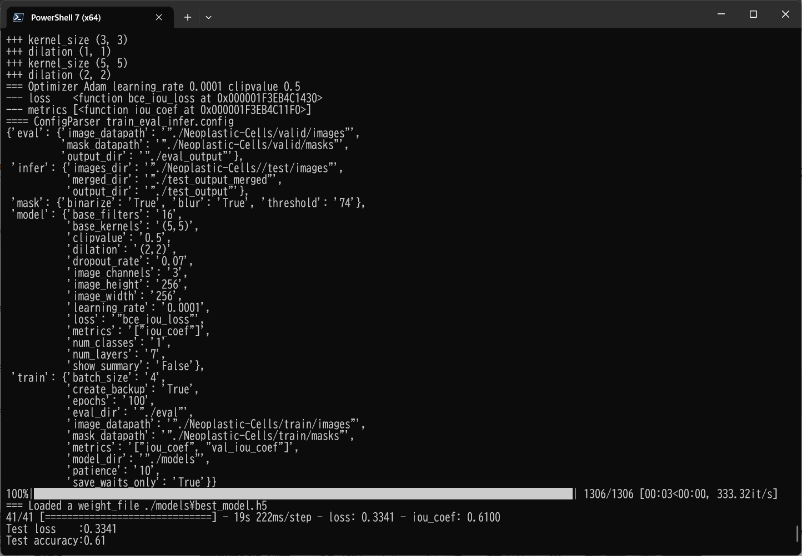

# Image-Segmentation-Neoplastic-Cell (2023/08/04)

<h2>
1 Image-Segmentation-Neoplastic-Cell
</h2>

This is an experimental project for Image-Segmentation of PanNuke Neoplastic-Cell-Nuclei by using
 <a href="https://github.com/atlan-antillia/Tensorflow-Slightly-Flexible-UNet">Tensorflow-Slightly-Flexible-UNet</a> Model,
which is a typical classic Tensorflow2 UNet implementation <a href="./TensorflowUNet.py">TensorflowUNet.py</a> 

The image dataset used here has been taken from the following kaggle web site.

<pre>
Cancer Instance Segmentation and Classification 1
https://www.kaggle.com/datasets/andrewmvd/cancer-inst-segmentation-and-classification
</pre>
<pre>
About this Dataset
This dataset, also known as PanNuke, contains semi automatically generated nuclei instance segmentation and 
classification images with exhaustive nuclei labels across 19 different tissue types. The dataset consists 
of 481 visual fields, of which 312 are randomly sampled from more than 20K whole slide images at different 
magnifications, from multiple data sources.
In total the dataset contains 205,343 labeled nuclei, each with an instance segmentation mask. Models trained 
on PanNuke can aid in whole slide image tissue type segmentation, and generalize to new tissues.

More Medical Imaging Datasets
Part 1 (current)
Part 2
Part 3
More datasets
Acknowledgements
If you use this dataset in your research, please credit the authors:

Original Publications
@article{gamper2020pannuke,
title={PanNuke Dataset Extension, Insights and Baselines},
author={Gamper, Jevgenij and Koohbanani, Navid Alemi and Graham, Simon and Jahanifar, Mostafa and Benet, 
Ksenija and Khurram, Syed Ali and Azam, Ayesha and Hewitt, Katherine and Rajpoot, Nasir},
journal={arXiv preprint arXiv:2003.10778},
year={2020}
}

@inproceedings{gamper2019pannuke,
title={Pannuke: An open pan-cancer histology dataset for nuclei instance segmentation and classification},
author={Gamper, Jevgenij and Koohbanani, Navid Alemi and Benet, Ksenija and Khuram, Ali and Rajpoot, Nasir},
booktitle={European Congress on Digital Pathology},
pages={11--19},
year={2019},
organization={Springer}
}

Hovernet formated files were provided by chandlertimm with the available code here.

License
CC BY NC SA 4.0

Splash Image
Image by Otis Brawley released as public domain by National Cancer Institute, available here
</pre>

 
<h2>
2. Install Image-Segmentation-Neoplastic-Cell
</h2>
Please clone Image-Segmentation-Neoplastic-Cell.git in a folder <b>c:\google</b>. 
<pre>
>git clone https://github.com/sarah-antillia/Image-Segmentation-Neoplastic-Cell.git 
</pre>
You can see the following folder structure in your working folder. 

<pre>
./Image-Segmentation-Neoplastic-Cell
├─asset
└─projects
    └─Neoplastic-Cell
        ├─eval
        ├─generator
        ├─models
        ├─Neoplastic-Cell
        │  ├─test
        │  │  ├─images
        │  │  └─masks
        │  ├─train
        │  │  ├─images
        │  │  └─masks
        │  └─valid
        │      ├─images
        │      └─masks
        ├─test_output
        └─test_output_merged
</pre>

<h2>
3 Prepare dataset
</h2>

Please download master <b>Part 1</b> dataset from the following kaggle web site.
<pre>
Cancer Instance Segmentation and Classification 1
https://www.kaggle.com/datasets/andrewmvd/cancer-inst-segmentation-and-classification
</pre>
<b>Part 1</b> has the following folder structure.
<pre>
,/Part 1
├─Author Notes
├─Images
└─Masks
</pre>
<b>Images</b> and <b>Masks</b> folders contain numpy *.npy files.

<h3>
3.1 Create jpg base dataset
</h3>
Please note that <b>masks.npy</b> file in Masks folder has six channels as shown below for each image in <b>images.npy</b>
in Image folder. 
<pre>
`masks.npy` an array of 6 channel instance-wise masks 
  0: Neoplastic cells, 
  1: Inflammatory, 
  2: Connective/Soft tissue cells, 
  3: Dead Cells, 
  4: Epithelial, 
  6: Background)
</pre>
For simplicity, we will extract <b>Neoplastic cells</b> masks only from the masks.npy file. 
 
Please run the following command to create  256x256 jpg image and mask dataset. 
<pre>
>python create_base.py
</pre>
<h3>
3.2 Create augmented master dataset
</h3>
Please run the following command to create rotated, mirrored and flipped images and masks from the jpg base dataset. 
<pre>
>python ImageMaskDatasetGenerator.py
</pre>

<h3>
3.4 Split master dataset 
</h3>
Please run the following command to split master to test, train and valid dataset, 
<pre>
>python split_master.py
</pre>

Finally, we have created the Neoplastic-Cells dataset. 
<pre>
./Neoplastic-Cells
├─test
│  ├─images
│  └─masks
├─train
│  ├─images
│  └─masks
└─valid
    ├─images
    └─masks
</pre>

<b>train images sample</b> 
 
 

<b>train masks sample</b> 
 
 
<b>Neoplastic-Cells dataset inspection</b> 
 
 

<h2>
4 Train TensorflowUNet Model
</h2>
 We have trained Neoplastic-Cell TensorflowUNet Model by using the following
 <b>train_eval_infer.config</b> file.  
Please move to ./projects/Neoplastic-Cell directory, and run the following bat file. 
<pre>
>1.train.bat
</pre>
, which simply runs the following command. 
<pre>
>python ../../TensorflowUNetTrainer.py ./train_eval_infer.config
</pre>
, where train_eval_infer.config is the following.
<pre>
; train_eval_infer.config
; Dataset of Neoplastic-Cells/
; 2023/08/04 (C) antillia.com

[model]
image_width    = 256
image_height   = 256

image_channels = 3
num_classes    = 1
base_filters   = 16
base_kernels   = (5,5)
num_layers     = 7
dropout_rate   = 0.07
learning_rate  = 0.0001
clipvalue      = 0.5
dilation       = (2,2)
loss           = "bce_iou_loss"
;metrics        = ["iou_coef", "sensitivity", "specificity"]
;loss           = "binary_crossentropy"
;metrics        = ["binary_accuracy"]
metrics        = ["iou_coef"]
show_summary   = False

[train]
epochs        = 100
batch_size    = 4
patience      = 10
metrics       = ["iou_coef", "val_iou_coef"]
;metrics       = ["binary_accuracy", "val_binary_accuracy"]
model_dir     = "./models"
save_waits_only = True
eval_dir      = "./eval"
image_datapath = "./Neoplastic-Cells/train/images"
mask_datapath  = "./Neoplastic-Cells/train/masks"
create_backup  = True

[eval]
image_datapath = "./Neoplastic-Cells/valid/images"
mask_datapath  = "./Neoplastic-Cells/valid/masks"
output_dir     = "./eval_output"

[infer] 
;images_dir = "./mini_test/"
images_dir = "./Neoplastic-Cells/test/images"
output_dir = "./test_output"
merged_dir = "./test_output_merged"

[mask]
blur      = True
binarize  = True
threshold = 74
</pre>

The training process has just been stopped at epoch 45 by an early-stopping callback as shown below.  
 
 
 
<b>Train metrics line graph</b>: 
 
 
<b>Train losses line graph</b>: 
 

<h2>
5 Evaluation
</h2>
 We have evaluated prediction accuracy of our Pretrained Neoplastic-Cell UNet Model by using <b>valid</b> dataset. 
Please move to ./projects/ Neoplastic-Cell/ directory, and run the following bat file. 
<pre>
>2.evalute.bat
</pre>
, which simply runs the following command. 
<pre>
>python ../../TensorflowUNetEvaluator.py ./train_eval_infer.config
</pre>
The evaluation result is the following. 
 
 

<h2>
6 Inference 
</h2>
We have also tried to infer the segmented region for 
<pre>
images_dir    = "./Neoplastic-Cells/test/images" 
</pre> dataset defined in <b>train_eval_infer.config</b>,
 by using our Pretrained  Neoplastic-Cell UNet Model. 
Please move to ./projects/ Neoplastic-Cell/ directory, and run the following bat file. 
<pre>
>3.infer.bat
</pre>
, which simply runs the following command. 
<pre>
>python ../../TensorflowUNetInferencer.py ./train_eval_infer.config
</pre>

<b><a href="./projects/Neoplastic-Cell/Neoplastic-Cells/test/images">Test input images</a> </b> 
 
 
<b><a href="./projects/Neoplastic-Cell/Neoplastic-Cells/test/masks">Test input ground truth mask</a> </b> 
 
 

<b><a href="./projects/Neoplastic-Cell/test_output/">Inferred images </a>test output</b> 
 
 
 

<b><a href="./projects/Neoplastic-Cell/test_output_merged">Inferred merged images (blended test/images with 
inferred images)</a></b> 
  

 
<!--
-->

 

<h3>
References
</h3>
